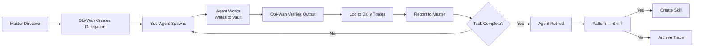

# Sub-Agent Registry

> *Single source of truth for all active, planned, and retired sub-agents.*

---

## Active Agents

| Agent ID | Specialization | Vault Write Scope | Status | Last Task | Created |
|----------|----------------|-------------------|--------|-----------|---------|
| — | — | — | — | — | — |

*No agents activated yet. Awaiting Master's directive.*

---

## Planned Specializations

| Agent ID | Role | Description | Vault Scope | Template |
|----------|------|-------------|-------------|----------|
| `researcher` | Deep Research | Web research, synthesis, fact-checking, literature review | `03_Context/references/` | `templates/researcher.md` |
| `coder-backend` | Backend Engineer | API design, databases, services, auth, testing | `03_Context/projects/backend/` | `templates/coder-backend.md` |
| `coder-frontend` | Frontend Engineer | React, TypeScript, UI components, state management | `03_Context/projects/frontend/` | `templates/coder-frontend.md` |
| `devops` | DevOps Engineer | CI/CD, infrastructure, monitoring, deployment | `03_Context/projects/infra/` | `templates/devops.md` |
| `analyst` | Data Analyst | Metrics, reporting, visualization, insights | `04_Daily_Logs/`, `03_Context/references/` | `templates/analyst.md` |
| `archivist` | Vault Archivist | Maintenance, linking, indexing, git sync | Entire vault | `templates/archivist.md` |

---

## Delegation Log

> *Format: YYYY-MM-DD HH:MM — Agent ID — Task — Outcome — Vault Ref*

*No delegations yet.*

---

## Agent Lifecycle

---

## Activation Protocol

1. **Master requests capability** not currently available
2. **Obi-Wan checks registry** for existing agent
3. **If exists & idle** → delegate to existing
4. **If exists & busy** → queue or spawn parallel (if different scope)
5. **If not exists** → Obi-Wan proposes specialization, Master approves
6. **Obi-Wan spawns** using template from `templates/`
7. **Agent registers** in this file with timestamp
8. **On completion** → agent marked idle, trace logged

---

## Resource Limits

| Resource | Limit | Config |
|----------|-------|--------|
| Concurrent agents | 3 | `delegation.max_concurrent_children` |
| Spawn depth | 1 | `delegation.max_spawn_depth` |
| Session timeout | 10 min | Per delegation (configurable) |
| Vault write scope | Per-agent | Defined in template |

---

*"Your focus determines your reality."*